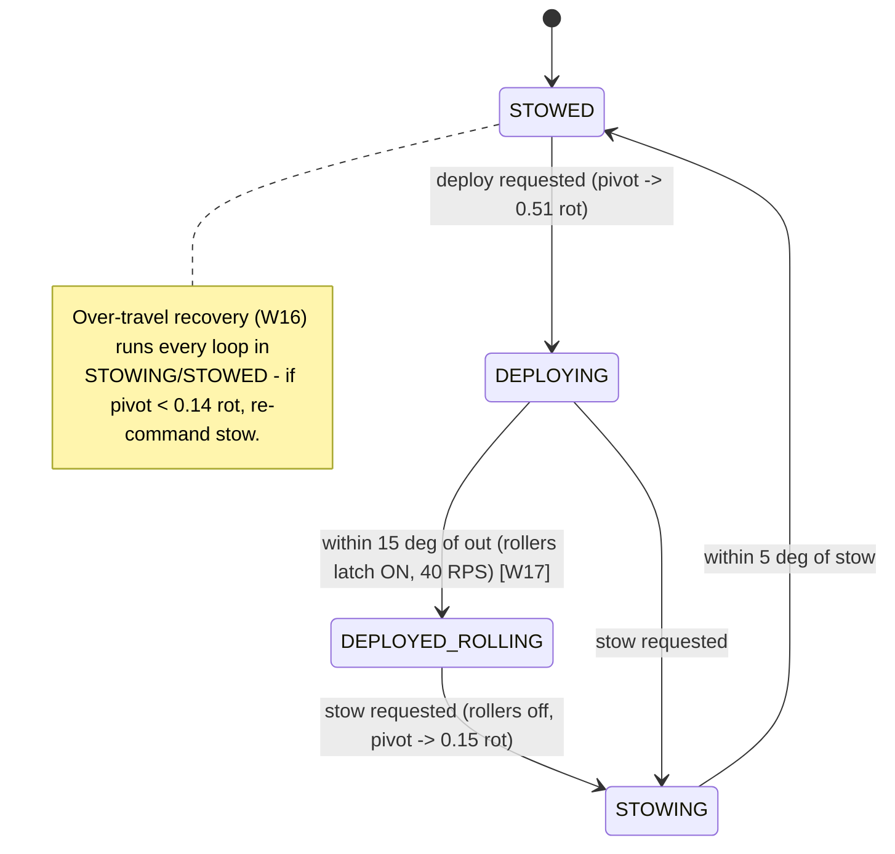

# Superstructure State Diagram

Source of truth for the robot-level state machine. Any PR that touches transitions MUST update this file (non-negotiable #8). Transition IDs (T0…T24) match REFACTOR_DESIGN.md §2 and the tests in TransitionsTest.

**Goals:** `IDLE`, `INTAKE` (toggle — surfaces as the INTAKING state when resting, as the `intakeDeployed` condition while shooting), `SHOOT`, `PASS`, `UNJAM`.

**Atomic transitions: exactly one** — `SHOOTING/PASSING → CLEARING [ATOMIC]`. On shot release the shooter stops and all indexers reverse at FULL speed for kClearingSeconds (default 2.0 s), backing committed balls away from the flywheel before IDLE/PASS goal changes are honored — no pinched balls, no wasted balls. SHOOT re-request (T23), UNJAM (T24) and MANUAL (T20) exit/preempt instantly.

`REST` = `intakeDeployed ? INTAKING : IDLE`.

## Scoring chain (RobotState)

```mermaid
stateDiagram-v2
    [*] --> IDLE

    IDLE --> INTAKING : T0 intake toggled on
    INTAKING --> IDLE : T0 intake toggled off

    IDLE --> SPINNING_UP : T1 SHOOT, !passSelected
    INTAKING --> SPINNING_UP : T1 SHOOT, !passSelected (intake stays deployed)
    IDLE --> PASS_SPINNING_UP : T2 SHOOT, passSelected
    INTAKING --> PASS_SPINNING_UP : T2 SHOOT, passSelected
    IDLE --> PASS_AIMING : T3 PASS
    INTAKING --> PASS_AIMING : T3 PASS
    IDLE --> UNJAMMING : T4 UNJAM
    INTAKING --> UNJAMMING : T4 UNJAM

    SPINNING_UP --> SHOOTING : T5 aimed && atShooterSpeed && shooterCommandedNonZero
    SPINNING_UP --> PASS_SPINNING_UP : T6 passSelected
    SPINNING_UP --> IDLE : T7 goal != SHOOT (no balls committed, no drain)

    SHOOTING --> SPINNING_UP : T8 gate lost (anti-dribble W13 / aim-loss fix W12)
    SHOOTING --> PASS_SPINNING_UP : T9 passSelected
    SHOOTING --> CLEARING : T10 goal IDLE or PASS [ATOMIC]
    SHOOTING --> UNJAMMING : T10u UNJAM

    PASS_AIMING --> PASS_SPINNING_UP : T11 SHOOT
    PASS_AIMING --> IDLE : T12 goal IDLE (to REST)
    PASS_AIMING --> UNJAMMING : T13 UNJAM

    PASS_SPINNING_UP --> PASSING : T14 atShooterSpeed
    PASS_SPINNING_UP --> SPINNING_UP : T15 !passSelected
    PASS_SPINNING_UP --> PASS_AIMING : T16 goal != SHOOT, LB held

    PASSING --> PASS_SPINNING_UP : T17 !atShooterSpeed
    PASSING --> CLEARING : T18 goal IDLE or PASS [ATOMIC]
    PASSING --> UNJAMMING : T18u UNJAM

    CLEARING --> IDLE : T22 clearingElapsed (to REST)
    CLEARING --> SPINNING_UP : T23 SHOOT re-requested
    CLEARING --> UNJAMMING : T24 UNJAM preempts the clear

    UNJAMMING --> IDLE : T19 goal != UNJAM (to REST)

    state MANUAL
    note right of MANUAL
        T20: reachable from EVERY state via operator Start,
        including mid-CLEARING (manual override is never blockable).
        T21: exit re-syncs to IDLE - turret target rebased to current,
        hood capture-once hold, shooter stopped, feed stopped.
        Never returns to the pre-manual state.
    end note
```

Edges drawn to IDLE labeled "(to REST)" land on INTAKING instead when the intake toggle is on (Mermaid can't draw a conditional target; the table in REFACTOR_DESIGN.md §2 is normative).

State behaviors:
- **IDLE** — turret hub-tracks (visual servo + gyro FF), shooter off, hood holds (capture-once), all indexers stopped.
- **INTAKING** — IDLE + intake deployed/rolling, vertical indexer 26.25 RPS (W18).
- **SPINNING_UP** — shooter+hood track interp tables (stale-held distance on vision loss), vertical 35 RPS, feed gate closed.
- **SHOOTING** — all stages feed (35/35/100 RPS).
- **CLEARING** — shooter stopped, all indexer stages reversed at full speed (−35/−35/−100 RPS) until kClearingSeconds (2.0 s) elapses.
- **PASS_AIMING** — turret aims along passing-tag surface normal (W25), shooter off.
- **PASS_SPINNING_UP / PASSING** — hood 0.067 rot, shooter 95 RPS (W14); feed gates on speed only.
- **UNJAMMING** — indexers −50%, shooter forward at max (W19).
- **MANUAL** — superstructure commands nothing; operator drives mechanisms directly.

## Intake nested machine (deploy/stow sequencing — inside the Intake subsystem)

Driven by `Superstructure.toggleIntake()` (operator A). Makes no robot-level decisions; the scoring chain sees only `Conditions.intakeDeployed` (which also selects INTAKING vs IDLE at rest).


